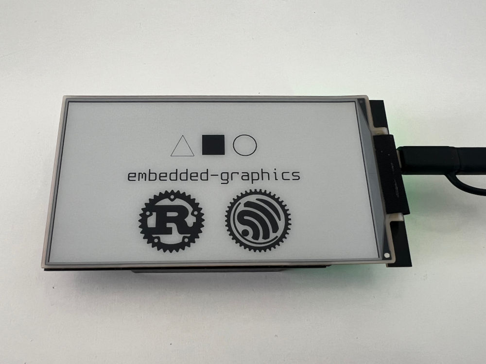

# LilyGo EPD47 Rust HAL



Simple driver for
the [LilyGo T5 4.7 Inch E-Paper display](https://www.lilygo.cc/en-pl/products/t5-4-7-inch-e-paper-v2-3).
The driver only supports the V2.3 hardware variant (ESP32-S3).

It should also work on the touch version, but I don't have the necessary hardware to validate that claim.

This library depends on `alloc` and requires you to set up the global allocator for the PSRAM. This is mainly due to
space requirements of the framebuffer and the lut (~325kb).

Built using [`esp-hal`] and [`embedded-graphics`]

[`esp-hal`]: https://github.com/esp-rs/esp-hal

[`embedded-graphics`]: https://docs.rs/embedded-graphics/

**WARNING:**

This is an experimental port of the C library. I ported the basic functionality and tried to simplify it as much as
possible. I give no guarantee that this is the correct usage of the hardware, use at your own risk!

## Usage

1. Prepare your development requirement according to
   this [guide](https://docs.esp-rs.org/book/installation/riscv-and-xtensa.html).
2. Create a new project, I recommend using `cargo-generate` and
   the [template](https://docs.esp-rs.org/book/writing-your-own-application/generate-project/index.html) provided
   by `esp-rs` (i.e. `cargo generate esp-rs/esp-template`)
3. Use the following template for your application and adopt for your needs.

```rust
#![no_std]
#![no_main]
extern crate alloc;

use embedded_graphics::{
    prelude::*,
    primitives::{Circle, PrimitiveStyle},
};
use embedded_graphics_core::pixelcolor::{Gray4, GrayColor};
use esp_backtrace as _;
use esp_hal::{
    clock::ClockControl,
    delay::Delay,
    gpio::Io,
    peripherals::Peripherals,
    prelude::*,
    system::SystemControl,
};
use lilygo_epd47::{Display, DrawMode};

#[entry]
fn main() -> ! {
    let peripherals = Peripherals::take();
    let system = SystemControl::new(peripherals.SYSTEM);
    let clocks = ClockControl::boot_defaults(system.clock_control).freeze();
    let delay = Delay::new(&clocks);
    // Create PSRAM allocator
    esp_alloc::psram_allocator!(peripherals.PSRAM, esp_hal::psram);
    // Initialise the display
    let mut display = Display::new(
        Io::new(peripherals.GPIO, peripherals.IO_MUX),
        peripherals.DMA,
        peripherals.LCD_CAM,
        peripherals.RMT,
        &clocks,
    );
    // Turn the display on
    display.power_on();
    delay.delay_millis(10);
    // clear the screen
    display.clear().unwrap();
    // Draw a circle with a 3px wide stroke in the center of the screen
    // TODO: Adapt to your requirements (i.e. draw whatever you want)
    Circle::new(display.bounding_box().center() - Point::new(100, 100), 200)
        .into_styled(PrimitiveStyle::with_stroke(Gray4::BLACK, 3))
        .draw(&mut display)
        .unwrap();
    // Flush the framebuffer to the screen
    display.flush(DrawMode::BlackOnWhite).unwrap();
    // Turn the display of again
    display.power_off();
    // do nothing
    loop {}
}
```

## Examples

Run examples like this ` cargo run --release --example <name>`.

- `counter` - Simple counter that updates every second. Only refreshes the screen partially
- `grayscale` - Alternating loop between a horizontal/vertical "gradient" of all the available colors. You may notice
  that the darker colors are harder to distinguish. This is probably due to the waveforms not being used (yet).
- `hello-world` - [`embedded-graphics`] demo. The bmp images used have been converted using
  imagemagick `convert <source>.png -size 200x200 -background white -flatten -alpha off -type Grayscale -depth 4 <output>.bmp`
- `screen-repair` - Showcases how to use the repair
  methodology [provided by lilygo](https://github.com/Xinyuan-LilyGO/LilyGo-EPD47/blob/master/examples/screen_repair/screen_repair.ino).
- `simple` - Boilerplate, same as the example above.
- `deepsleep` - Deep sleep example. Note: my board suffered from occasional brownouts, I fixed it
  using [this](https://github.com/Xinyuan-LilyGO/LilyGo-EPD47/issues/98#issuecomment-1715584471) modification. I
  measured ~230μA on average during deep sleep using the Nordic PPKII.

## Todos

- [ ] Basic examples and docs
- [ ] Compare performance to original implementation
- [ ] Implement Waveforms / LUT

## Credits

This project is largely based on the C implementations provided by:

* [Official LilyGo Driver](https://github.com/Xinyuan-LilyGO/LilyGo-EPD47)
* [epdiy](https://github.com/vroland/epdiy)

## License

Unless otherwise stated the provided code is licensed under the terms of the GNU General Public License v3.0.

